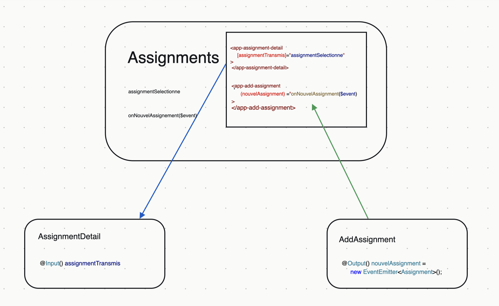

# 5. Communication inter-composants

## Support de cours

[Partie 5](https://docs.google.com/presentation/d/1Z6-lyeMALH-pLg1pMFXzfJ8ZGz6TL3dYytved0445jc/edit?pli=1#slide=id.ga2aa790270_0_489) du transparent 79 au transparent 108

## Contenu

Cette partie vous propose de créer dans l'applications des composants spécialisés, fils du composant qui gère les "assignments".

- un composant pour afficher les détails d'un assignment quand on clique dessus,
- un composant pour ajouter un assignment,
- un composant pour supprimer un assignment etc.

Et on verra un problème très courant dans la programmation par composants : la communication *père-fils* et la communication *fils-père*, via les bindings de type *property binding* et *event binding* avec `@input` et `@output`.

Dans la suite du cours on verra une manière plus confortable de centraliser les données manipulées (ici les _assignments) et de les partager grâce aux **services**. Les **routes** seront aussi utilisées pour naviguer entre les différentes vues de l'application.

## A faire

1. Suivre le support de cours jusqu'à la page 108,
2. en continuant votre propre TP, celui avec sidenav et toolbar
3. Vous essaierez de faire l'exercice proposé à la fin (suppression d'un assignment / DELETE).

## Vidéo

[Vidéo de 2020 qui montre comment faire cette partie.](https://www.youtube.com/watch?v=UsZ3uTTGbMk)

## Tag GitHub
`partie5`

[Suivant](Partie6.md)
